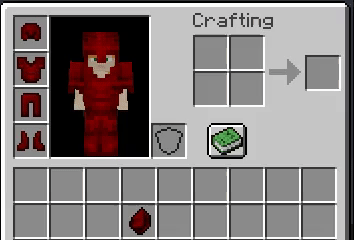

# Texture (1.17)


This feature requires ItemsAdder 2.4.22+ and Minecraft 1.17.

It can't work on Minecraft 1.16 and previous versions.

Check the [Optifine tutorial](texture.md#optifine-1.16-and-lower) if you have lower Minecraft version.



You must enable this setting in `config.yml` file of ItemsAdder.&#x20;

And set it to `VANILLA_1_17`

```yaml
    generate-custom-armors-textures:
      enabled: true
      mode: VANILLA_1_17
```



If you see **bugged** textures and you have **Optifine** installed please [read here](../../../../../faq/armors-textures-bugged.md).


## Creating the armor renderer


An armor renderer is a setting which contains the information how to show the armor ingame on the player body.

Note: there can be only one armor renderer with per color.


```yaml
info:
  namespace: myitems
armors_rendering:
  my_armor:
    color: "#d60000"
    layer_1: armor/my_armor/layer_1
    layer_2: armor/my_armor/layer_2
    use_color: false
```

This is a configuration which specified how the game will show the armor ingame.


You must decide a color! Even if the armor won't be colored. The color is like an ID (identifier) for the custom armor renderer.


`use_color` disables the recoloring of the armor using the specified `color: "#d60000"`. In some cases you may want to recolor the armor using the specified `color`, so you will have to set it to `true`. **** This option will also make the item (in inventory) not colored automatically anymore.

`color` is the color attribute of this armor. It acts like an unique identifier for the armor (and will tint the armor if `use_color` is `true`). Use this website to get a valid color: [https://minecraftcommand.science/armor-color](https://minecraftcommand.science/armor-color)

Now I create the two PNG files inside the `data/resource_pack/assets/myitems/textures/armor/my_armor/` folder.

 (1) (1).png>)


### HD armor textures

You can create HD high resolution armors too!&#x20;

Just make sure they have the same proportions of the original.&#x20;

For example 64x32, 128x64, 256x128, 512x256..... <mark style="color:red;">it's very important! Size must be a power of 2.</mark>


### Creating an armor piece

For example let's create a chestplate (you will create the other pieces on your own, following the same method).

```yaml
  my_armor_chestplate:
    display_name: "My Armor Chestplate"
    permission: my_armor_chestplate
    resource:
      generate: true
      textures:
      - item/my_armor/chestplate
    durability:
      max_custom_durability: 602
    specific_properties:
      armor:
        slot: chest
        custom_armor: my_armor
    attribute_modifiers:
      chest:
        armor: 8
        armorToughness: 3
```

The `custom_armor` property is important, it makes the plugin use the previous textures setting (`armors_renderer`) for this armor piece.

In this case I didn't specify any `color` in the `specific_properties` field of the armor piece because it's already specified in the `custom_armor` property.

Now I create the item texture and I put it inside the `data\resource_pack\assets\myitems\textures\item\my_armor\` folder (in this example I created also a new folder called `my_armor` to better organize the resourcepack).

 (1).png>)

 (1).png>)

### Animated textures

You can also create animated armors!



To create an animated armor you have to create an image with all the animation frames.

Each frame must be under the previous. This is an example this is a 3 frames animation:

.png>)


Now let's edit the rendering properties to support the animation.

```yaml
info:
  namespace: myitems
armors_rendering:
  my_armor:
    color: "#d60000"
    layer_1: armor/my_armor/layer_1
    layer_2: armor/my_armor/layer_2
    use_color: false
    animation:
      interpolation: true
```

In this case I set `interpolation: true` because I want the animation to be smooth.

Default speed is 24, but you can customize it until you find the right speed value:

```yaml
    animation:
      speed: 30
      interpolation: true
```

### Emissive textures (glowing in the dark)

You can also create emissive textures which glow in the dark. (You can make both animated and emissive textures at the same time!)

```yaml
info:
  namespace: myitems
armors_rendering:
  my_armor:
    color: "#d60000"
    layer_1: armor/my_armor/layer_1
    layer_2: armor/my_armor/layer_2
    emission_1: armor/my_armor/emission_1
    emission_2: armor/my_armor/emission_2
    use_color: false
```

In this case I want to make the previous animation emissive, I want it to glow in the dark.

You have to make 2 textures in order to make the textures glow.&#x20;

* the **black** part will **glow**
* the **transparent** part **won't glow**

In this example I want the whole texture to glow so I make it all **black**.


## Optifine (1.16 and lower)


This method is compatible with any Minecraft version (player must have Optifine installed).



You must enable this setting in `config.yml` file of ItemsAdder.&#x20;

And set it to `OPTIFINE`

```yaml
    generate-custom-armors-textures:
      enabled: true
      mode: OPTIFINE
```


Follow the same tutorial [up here](texture.md#creating-the-armor-renderer), the only difference is that (for now) emissive textures are not supported.

This Optifine tutorial will be updated in the future, if you want you can follow the manual way of creating Optifine armors:


[armor-textures.md](../../../optifine-only-features/armor-textures.md)

